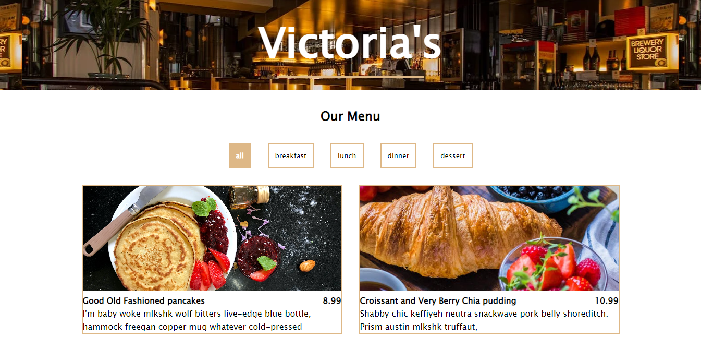

# Menu created with React
This is a project I built with React after taking the course from [FreeCodeCamp](https://www.youtube.com/watch?v=a_7Z7C_JCyo&t=6699s). Feedback and questions are welcome!

## About
The project consist of a menu that can be filtered by its categories. The menu consist of a grid that shows a picture of a menu item, the name of the dish, the price and a description.

## Tech/framework used
Built with:
* React
* CSS3
* JS

## Demo
Available at https://victoria-parker.github.io/menu-react-app/
